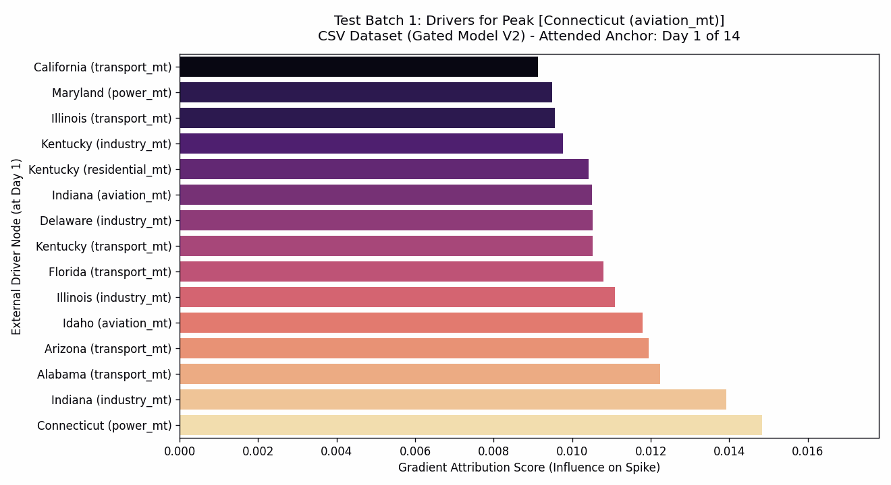

# ST-Mamba: Spatio-Temporal Mamba for Dynamic Carbon Flux Forecasting

**Data and Weights Acquisition**
* **Datasets & Matrices:** Download the processed `.npy` tensors and causal graphs from our Zenodo archive: [https://doi.org/10.5281/zenodo.23223557]
* **Pre-trained Weights:** Due to file size limits, the 14-day evaluation weights (baseline and ST-Mamba) are hosted via Google Drive: [https://drive.google.com/drive/folders/107UTrByjuZisvRNW5nN9hj2LSbUtBAp4?usp=sharing]

## Overview
Traditional Spatio-Temporal Graph Convolutional Networks (STGCN) rely on static adjacency matrices, creating a "black-box" effect that fails to explain daily environmental shifts. **ST-Mamba** bridges the gap between high-tier forecasting accuracy and dynamic transparency. By integrating a `GatedCausalGCNLayer` with a Mamba linear state-space engine, this architecture achieves highly competitive forecasting parity with heavily stabilized baselines while unlocking day-by-day dynamic explainability (XAI) for real-world climate policy.

**Core Contributions:**
* **Causal Discovery:** PCMCI-based spatial graph initialization to map true multi-variate causal links.
* **Dynamic Explainability:** Extracted attention weights provide visual frames of shifting carbon dependencies.
* **Robust Benchmarking:** Evaluated against a stabilized STGCN baseline utilizing Huber Loss and gradient clipping.

## Benchmark Results (14-Day Window)
The models were evaluated deterministically across 5 random seeds (42, 100, 2026, 333, 777) on both univariate Carbon (CSV) and multivariate Weather (NPY) datasets. The dataset has been splitted into training, validation and test section. From 01-01-2023 to 30-04-2025 that's splitted into training data. Then from 01-05-2025 to 31-08-2025 is the validation data and finally 01-09-2025 to 31-12-2025 is the test data. The values that are given below are overall from the 5 random seeds

## Validation Performance

| Model | Dataset | RMSE | MAE | R² Score | Accuracy |
| :--- | :--- | :--- | :--- | :--- | :--- |
| **STGCN Baseline** | Carbon (CSV) | 14014.39 ± 752.71 | 6010.07 ± 496.99 | 0.9765 ± 0.0026 | 88.97% ± 0.91% |
| **ST-Mamba Version1 (Ours)** | Carbon (CSV) | 12782.78 ± 145.08 | 5672.51 ± 100.62 | 0.9805 ± 0.0004 | 89.59% ± 0.18% |
| **ST-Mamba Version2 (Ours)** | Carbon (CSV) | 12835.40 ± 276.10 | 5547.12 ± 153.87 | 0.9803 ± 0.0009 | 89.82% ± 0.28% |
| **STGCN Baseline** | Weather (NPY) | 12978.42 ± 48.82 | 5450.70 ± 35.48 | 0.9799 ± 0.0002 | 90.00% ± 0.07% |
| **ST-Mamba Version1(Ours)** | Weather (NPY) | 14635.23 ± 256.43 | 6729.48 ± 208.48 | 0.9744 ± 0.0009 | 87.65% ± 0.38%% |
| **ST-Mamba Version2(Ours)** | Weather (NPY) | 6810.57 ± 376.65 | 14610.71 ± 662.29 | 0.9745 ± 0.0023 | 87.50% ± 0.69%% |

## Test Data Performance
| Model | Dataset | RMSE | MAE | R² Score | Accuracy |
| :--- | :--- | :--- | :--- | :--- | :--- |
| **STGCN Baseline** | Carbon (CSV) | 17004.46 ± 774.21 | 6734.7319 ± 461.01 | 0.9650 ± 0.0033 | 88.31% ± 0.80% |
| **ST-Mamba Version1 (Ours)** | Carbon (CSV) | 24258.52 ± 9530.49 | 9056.82 ± 1763.87 | 0.9179 ± 0.0718 | 84.29% ± 3.06% |
| **ST-Mamba Version2 (Ours)** | Carbon (CSV) | 18210.21 ± 227.75 | 7576.34 ± 105.26 | 0.9599 ± 0.0010 | 86.85% ± 0.18% |
| **STGCN Baseline** | Weather (NPY) | 15983.3182 ± 183.3702 | 6185.1318 ± 50.4566 | 0.9691 ± 0.0007 | 89.27% ± 0.09% |
| **ST-Mamba Version1(Ours)** | Weather (NPY) | 19568.11 ± 449.64 | 8537.61 ± 215.24 | 0.9537 ± 0.0021 | 85.19% ± 0.37% |
| **ST-Mamba Version2(Ours)** | Weather (NPY) | 19264.62 ± 351.37 | 8390.06 ± 157.80 | 0.9551 ± 0.0016 | 85.44% ± 0.27% |

*(Note: While the STGCN baseline achieves slightly higher raw accuracy on short sequences, ST-Mamba provides near-parity forecasting while generating dynamic spatial XAI.)*

## Visualizing Dynamic Spatial Flow (XAI)

*Caption: Day-by-day shifting attention weights generated by ST-Mamba's GatedCausalGCNLayer.*

## Installation & Usage

**1. Environment Setup**
Ensure you have installed [PyTorch](https://pytorch.org/) matching your specific CUDA version. Then install the required dependencies:
```bash
pip install -r requirements.txt